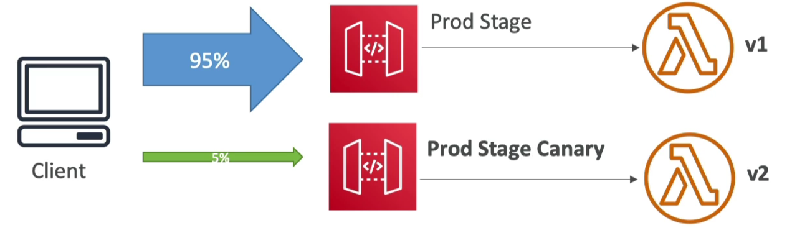
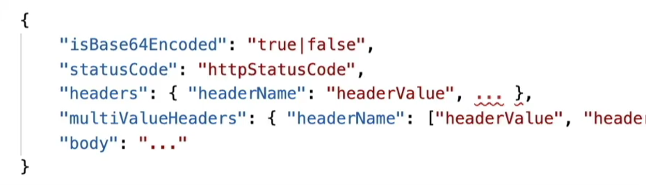

# API Gateway

- [Visão geral](#visão-geral)
- [API Gateway - Integrations High Level](#api-gateway---integrations-high-level)
  - [Lambda Function](#lambda-function)
  - [HTTP](#http)
  - [Serviços AWS](#serviços-aws)
  - [Mock](#mock)
- [Tipos de endpoints](#tipos-de-endpoints)
- [Segurança](#segurança)
- [Stages \& Deployment](#stages--deployment)
  - [Configurações adicionais do stage](#configurações-adicionais-do-stage)
  - [Logs e tracing](#logs-e-tracing)
  - [Canary deploy](#canary-deploy)
- [Mapping templates](#mapping-templates)
- [Open API spec](#open-api-spec)

## Visão geral

Serviço para exposição de APIs sem gerenciamento de servidor.

Principais funcionalidades:

- AWS Lambda + API Gateway: Exposição de lambda como API sem gerenciamento de servidores.
- WebSocket.
- Versionamento de APIs (v1, v2...).
- Gerenciamento de ambientes (dev, test, prod...).
- Gerenciamento de seguração (autenticação e autorização).
- API keys para gerenciamento de cotas.
- Pode ser contruida importando arquivo Open API.
- Transformação e validação de requests e responses.
- Criação de SDK e especificações de APIs.
- Cache de respostas.

## API Gateway - Integrations High Level

### Lambda Function

- Invocar lambdas.
- Caminho fácil para expor REST API baseados em lambdas.

### HTTP

- Exposição de HTTP API on premisse, Application Load Balancer, etc.
- Motivo: Adicionar rate limit, cache, user authenticamente, api keys, etc... a serviços legados.
- Para acessar recursos hospedados na VPC, é necessário o VPC Link.

### Serviços AWS

- Expor qualquer serviço AWS a partir do Gateway.
- Exemplo: Iniciar uma step function a partir de uma mensagem SQS postada diretamente do gateway.
- Motivo: Adicionar autenticação, rate limit, etc...

### Mock

- Respostas pré-definidas no gateway, geralmente para testes.

## Tipos de endpoints

**Edge-optimized (default)**

Para clientes globais, as requisições são roteadas através de **CloudFront Edge** locations para melhorar a latência.

O gateway está em apenas uma região, mas é acessível de forma eficiente a partir de cada local através do CloudFront Edge.

**Regional**

Para usuários na mesma região de criação do API Gateway.

Tecnicamente, acessível de qualquer lugar do mundo, porém sem otimizações de CDN oferecida pelo CloudFront Edge.

**Private**

Acessível somente de dentro da VPC, utilizando VPC endpoints (ENI).

Pode ser utilizado "resource policy" para definitir acessos ao gateway.


## Segurança

**Autenticação do usuário**

- IAM roles: Para aplicações internas (Ex.: EC2 acessando uma API).
- Cognito: Para usuários externos, como aplicativos mobile ou páginas web.
- Custom Authorizer: Lógica personalizada para outro Auth Server.

**Custom Domain Name HTTPS**

- Segurança através de certificado gerado pela AWS Certificate Manager (ACM).
  - Se utilizado Edge-Optimized endpoint, o certificado ficará em us-east-1.
  - Se utilizado Regional endpoint, o certificado ficará na mesma região.
  - Deve ser configurado o CNAME, A, ou ALIAS no Route 53.

## Stages & Deployment

- Podem ser criadas variáveis do stage e elas podem ser utilizadas para compor muitos nomes no template de integrações, por exemplo:
  - Lambda ARN.
  - HTTP endpoint.
  - Parameter mapping template.
- Stage variable são passadas no objeto "context" para Lambdas.
- Format para utiliza-las na definição de api: `${stageVariables.NOME}`

Existem configurações independentes por stage, veja abaixo os detalhes.

### Configurações adicionais do stage

- Cache
  - TTL
- Throttling
  - Rate
  - Burst
- Firewal and cetificate (WAF)

### Logs e tracing

- Nível de log gerado no cloud watch:
  - Off.
  - Errors only.
  - Erros and info.
  - Full request and response logs.
- Métricas detalhadas: Chamadas de API, Adicionar latencia, 400 erros e 500 erros nas estatísticas.
- X-ray.
- CloudWatch Logs: Logs internos do api gateway
  - Em apis rest, é armazenado no log group: API-Gateway-Execution-Logs_{rest-api-id}/{stage-name}  (não pode ser alterado)
  - <https://repost.aws/knowledge-center/api-gateway-cloudwatch-logs>
  - Necessário configurar a role utilizada pelo serviço da AWS de API Gateway para gerar logs. Não é do seu gateway, mas do serviço AWS.
    - <https://coady.tech/aws-cloudwatch-logs-arn/>
- Custom Access Logging: Log das requisições
  - Detalhes em <https://docs.aws.amazon.com/apigateway/latest/developerguide/set-up-logging.html#apigateway-cloudwatch-log-formats>
  - Campos disponíveis em:
    - <https://docs.aws.amazon.com/apigateway/latest/developerguide/http-api-logging-variables.html>
    - <https://www.alexdebrie.com/posts/api-gateway-access-logs/#access-logging-fields>

### Canary deploy



- Habilitado por stage.
- Indicar o percentual do trafego que cada canal canário deve receber.
- Métricas e logs são separados.
- Possibilidade de sobrescrever variáveis de state.

## Mapping templates

Permite manipular a requesição encaminha para o backend, e a resposta enviada para o cliente.



Feature x Integration types:

- MOCK: Retorna um payload sem backend, portante não precisa de mapeamento de templates para manipular isso.
- AWS_PROXY / Lambda Proxy:
  - Suporte a manipulação de informações.
  - Não ativar feature "proxy integration" no setip da rota/metodo.
- HTTP_PROXY:
  - Sem suporte a manipulação de payload por mapeamento de templates.
  - Possível adicionar headers.

Funcionalidades:

- Modificar request/response.
- Renomear e modificar query string.
- Modificar body.
- Adicionar headers.
- Linguagem: Velocity Template Language (VTL): for loop, if, etc...
- Filtrar resultado e remover dados desnecessários.
- Aplicar Content-Type application/json ou application/xml.

Template exemplo para renomear campo e retornar um valor fixo:

```json
{
    "valorFixo": "meu valor",
    "campoRenomeado": $input.json('$.campoOrigem')
}
```

## Open API spec

API Gateway pode ser gerado a partir da especificação de API como código (Open API).