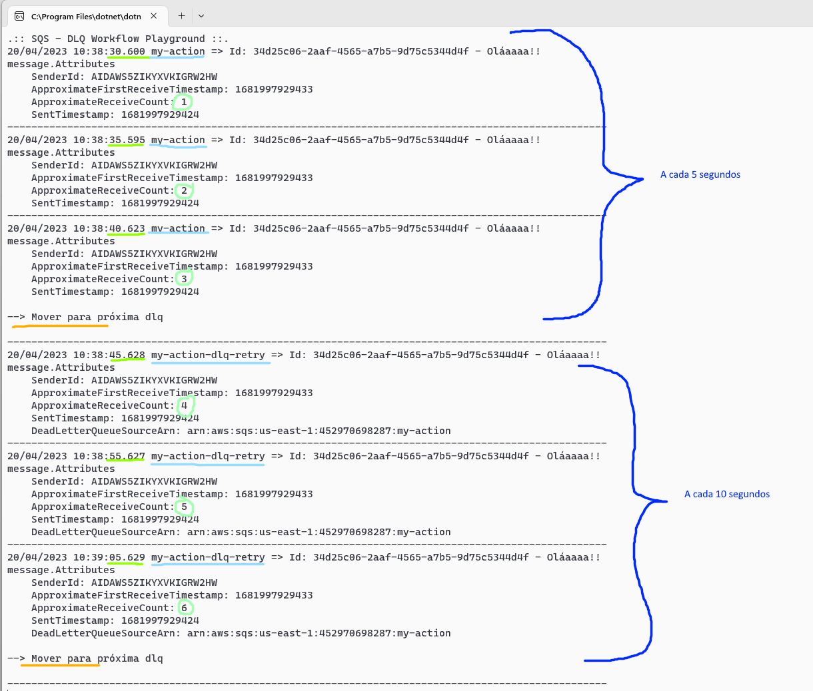

# SQS

- [DLQ Workflow](#dlq-workflow)
  - [Exemplo de configuração para um cenário real](#exemplo-de-configuração-para-um-cenário-real)

## DLQ Workflow

Workflow com duas DQLss baseado no [blog post aws](https://aws.amazon.com/pt/blogs/compute/using-amazon-sqs-dead-letter-queues-to-replay-messages/).

O objetivo deste workflow é manter os recursos principais para atender a operação online, proteger consumo de recursos desnecessário em caso de falhas
e reprocessar falhas com menor prioridade.

O workflow é composto de 3 filas:

- **Fila 1: Principal**
  - Objetivo: Atender operação near real time
  - Deve possuir auto scaling dos consumidores
  - Baixa quantidade de retry (Recomendado 2 ou 3)
  - Baixo timeout para mensagem ficar visivel para reprocessar em caso de falha.
    Calcule o tempo adequado com base no seu processo.
- **Fila 2: DLQ com auto retry**
  - Objetivo: Reprocessar transações mal sucedidas (Resiliência do processo).
  - Não necessita auto scaling pois se a mensagem cair aqui, a maior parte do ciclo de vida da fila tende a ser erro. Com isso:
    - Evitamos consumo e custo desnecessário de recursos cloud.
    - A mensagem está em loop com previsão de erro pra grande maioria dos casos e não queremos apenas falhar mais com escala de recursos.
  - Duas são as situações mais comuns de falha que direcionam a mensagem para este ponto:
    - Dependência com outro sistema inoperante/instável: Neste caso a solução está fora do seu domínio, quando o sistema terceiro for reestabelecido
      as mensagens represadas na DLQ serão reprocessadas
    - Situação não tratada no código fonte: Temos um tempo de vida delimitado nas configurações da fila para que o problema seja identificado,
      corrigido e a nova versão do software seja implantada.
  - Em ambos os casos:
    - O tempo máximo para resiliência automática é de: `visibility_timeout_seconds` * `maxReceiveCount`.
    - Se haver muitas mensagens pendentes, elas não concorrerão com o fluxo online da aplicação, pois aqui não tem auto scaling.
      A ideia é essa fila ser processada lentamente enquanto os recursos são utilizado pra dar conta da operação online na fila principal.
- **Fila 3: DLQ**
  - Objetivo: Descarte de mensagens improcessáveis
  - Não temos consumidor nesta fila por padrão. Ela serve para dar fim ao ciclo de vida da mensagem e não ficar em loop infinito dando erro (nem consumindo recursos).
  - Tenha em mente que filas sempre são otimistas, uma mensagem nunca deve ser publicada para falhar.
  - Você também deve monitorar as mensagens que chegaram a este ponto e adequar seu software para trata-las, mesmo que o tratamento seja o descarte consciente dela.
  - Mas se a janela de tempo da fila 2 não foi o suficiente para corrigir o software e as mensagens estão parando aqui, você pode:
    1. Conectar o consumidor nesta fila momentâneamente até zera-la e depois desconecta-lo.
    2. Fazer uma rotina que mova as mensagens para fila de retry ou para principal.
       Neste cenário você pode até mesmo validar a correção movendo uma pequena quantidade de mensagens para fila retry/principal. Não ocorrendo falha, pode mandar todas.

Com este fluxo é preservado o mesmo id de mensagem, evitando falsas estatíticas com re-publicações "progamadas" via código.

Arquivo terraform em [infra/dlq-workflow.tf](infra/dlq-workflow.tf) e código fonte na pasta [src/dlq-workflow](src/dlq-workflow).

**Fluxo da mensagem:**

**Estado final da mensagem na fila dlq:**

### Exemplo de configuração para um cenário real

**Caso de uso:** Para cada mensagem publicada na fila, você deve fazer duas integrações HTTP e uma atualização no banco de dado.  
**Restrições:** Para cada integração HTTP definiremos um timeout de 15 segundos.  
**Tempo máximo conhecido para processar mensagem:** Com o caso de uso e restrições, podemos calcular que com comunicação HTTP
teremos no máximo 30 segundos (2 requests x 15 segundos timeout) e iremos considerar mais 5 segundos para operação no banco de dados.

Configurações:
- Fila 1:
  - visibility_timeout_seconds: 35 segundos (Tempo máximo conhecido)
  - maxReceiveCount: 3 vezes
- Fila 2: Ao falhar 3 vezes na primeira
  - visibility_timeout_seconds: 1800 segundos (30 minutos)
  - maxReceiveCount: 240 vezes
  - Resumo: Tentar reprocessar durante 5 dias, com intervelado de 30 minutos (30 min x 240 = 5 dias)
- Fila 3: Mensagens improcessáveis